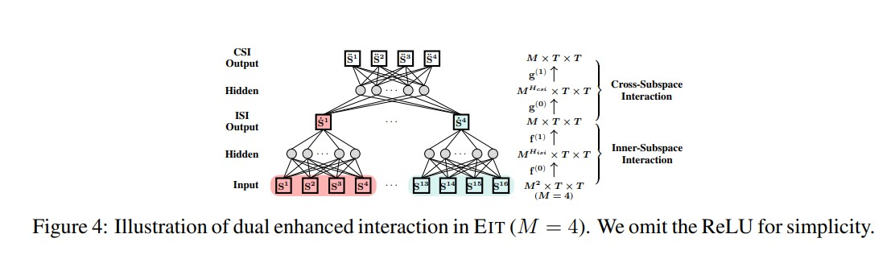

# Eit-Enhanced-Interactive-Transformer



Implementation of [EIT: ENHANCED INTERACTIVE TRANSFORMER](https://arxiv.org/abs/2212.10197), the Enhanced Interactive Transformer (EIT), to address the issue of head degradation in self-attention mechanisms. The author's approach replaces the traditional multi-head self-attention mechanism with the Enhanced Multi-Head Attention (EMHA) mechanism, which relaxes the one-to-one mapping constraint among queries and keys, allowing each query to attend to multiple keys. Furthermore, the authors introduce two interaction models, Inner-Subspace Interaction and Cross-Subspace Interaction, to fully utilize the many-to-many mapping capabilities of EMHA. Extensive experiments on a wide range of tasks (e.g. machine translation, abstractive summarization, grammar correction, language modelling and brain disease automatic diagnosis) show its superiority with a very modest increase in model size.

## Install

```python
pip install einops
```

followed by, 

```python
git clone https://github.com/shabie/docformer.git 
```

## Usage
```python
from src.modeling import Encoder

config = {
    "hidden_dropout_prob": 0.1,
    "hidden_size": 768,
    "intermediate_ff_size_factor": 4,
    "num_attention_heads": 12,
    "num_hidden_layers": 12,
    "use_efficient" : False  ## Can be True or False
  }

encoder = Encoder(config)
sample_vect = torch.rand(1, 512, 768)
out_vec = encoder(sample_vect)
print(out_vec.shape)
```
## Maintainers

- [uakarsh](https://github.com/uakarsh)


## Citations

```bibtex
Zheng, T., Li, B., Bao, H., Xiao, T., & Zhu, J. (2022). EIT: Enhanced Interactive Transformer. arXiv. https://doi.org/10.48550/arXiv.2212.10197
```